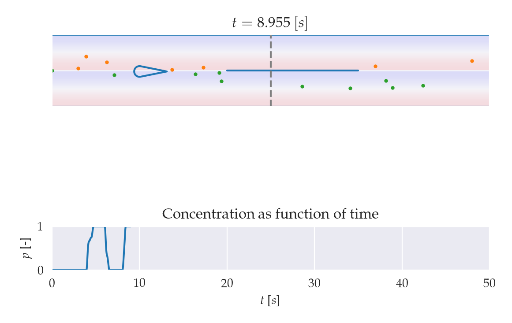

# AFC_OnlineLearning

### How to run the simulation 
Navigate to the main.py file in the structuralModels directory and open it the editor of your choice, the below CLI commands will open the relevant file in VSCode: 

```
cd src/structuralModels

code main.py 
```


Running this file should show a window with two plots stakced above eachother that are updating with time. The animation at the top a simulation of a soft robotic tentacle immersed in a fluid channel. The live plot below this animation plots the value of a metric related to the distribution of particles within the channel 

There is an incoming flow from the left-hand side of the channel. Particles colored orange and green are visible. These are tracer particles released from the channel inlet. Particles released from the upper half of the channel are colored orange and those released from the bottom half of the channel are colored green. This is to illustrate the mixing of particles. The measurement point is indicated by the verticle dotted line in the middle of the split channel. It is at this point that the particles are counted. 

### What am I seeing in the terminal? 
The terminal prints: `rt`, the number of particles passing the measure point above the split channel, the number of particles passing the measurement point below the split channel. `rt` is a function of the ratio of the particles passing below the split channel to the total number of particles having passed the measurement point within a time window \tau. 

### Simulation Components 


####  The Environment 

#### Robotic Tentacle 

#### Tracer Particles 

#### The Metric 
